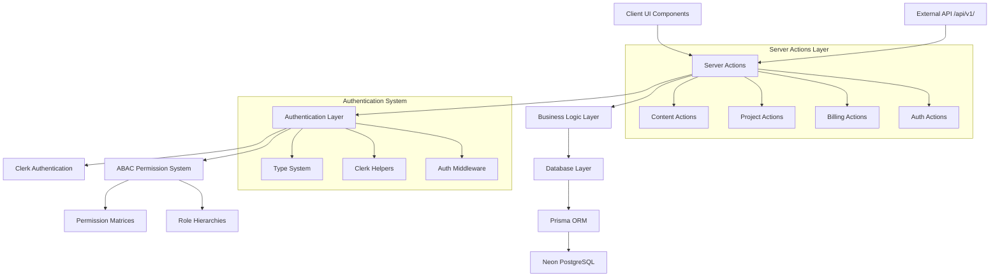
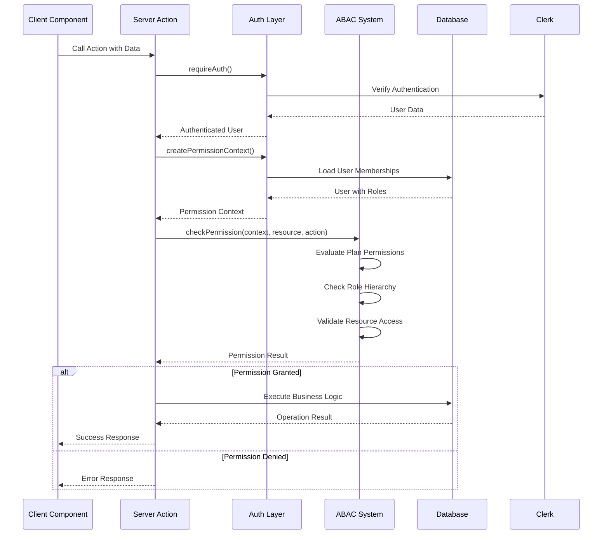
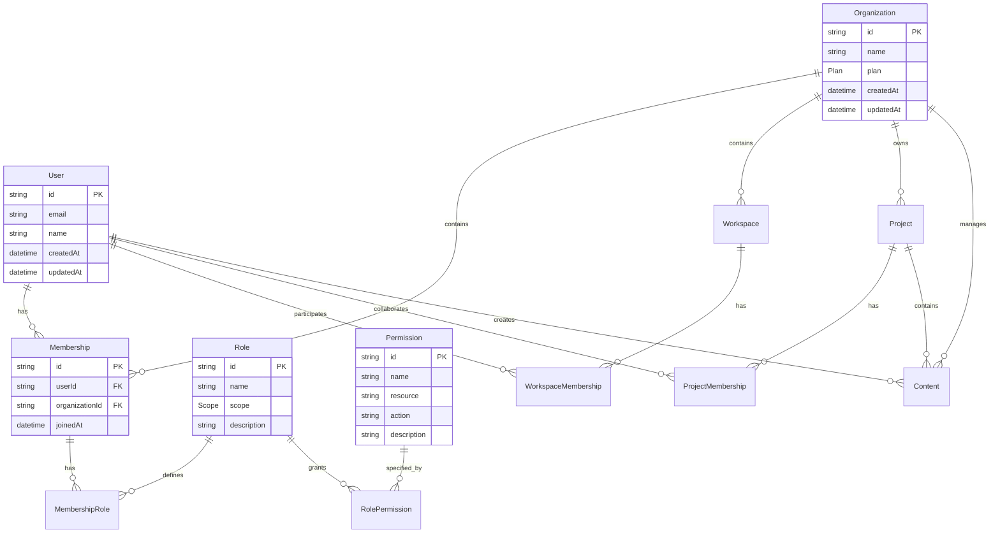
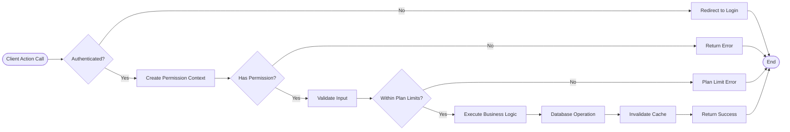
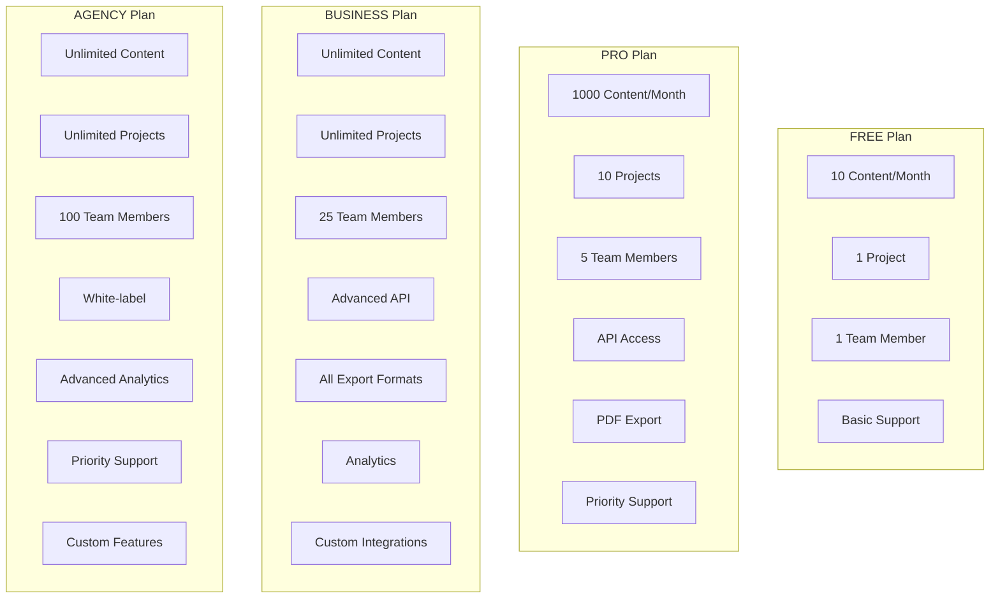
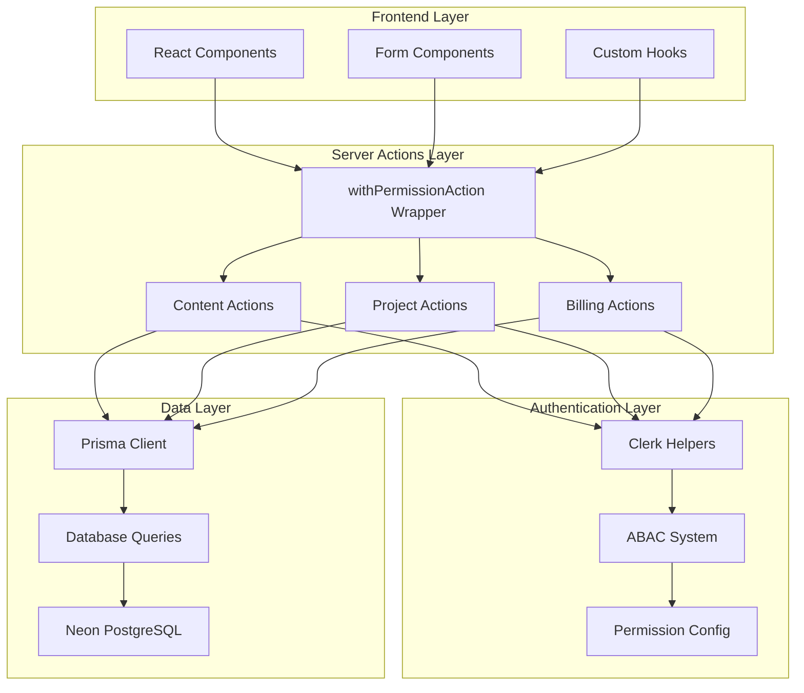
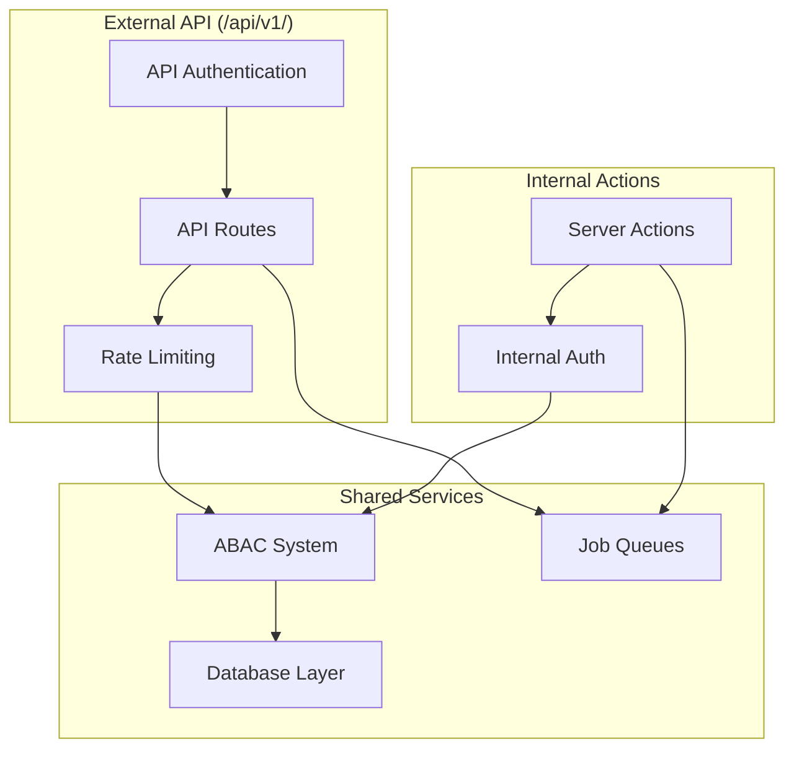
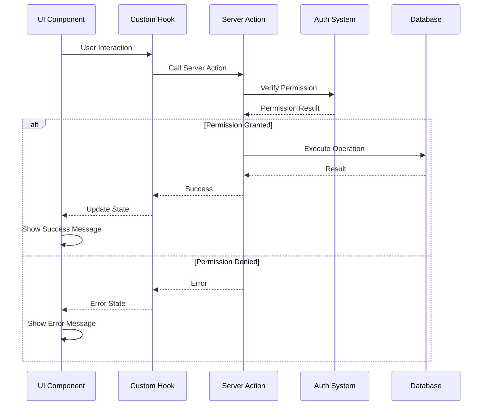

# Server Architecture Diagram

## 🏗️ System Architecture Overview

## 🔐 Permission Flow Diagram

## 📊 Database Relationship Diagram

## 🎯 Role Hierarchy Visualization

```mermaid
graph TB
    subgraph "Organizational Roles"
        O1[Owner] --> O2[Admin]
        O2 --> O3[Member]
        O3 --> O4[Viewer]
    end
    
    subgraph "Workspace Roles"
        W1[Admin] --> W2[Editor]
        W2 --> W3[Viewer]
    end
    
    subgraph "Project Roles"
        P1[Owner] --> P2[Editor]
        P2 --> P3[Collaborator]
        P3 --> P4[Viewer]
    end
    
    subgraph "Plan Hierarchy"
        PL1[CUSTOM] --> PL2[AGENCY]
        PL2 --> PL3[BUSINESS]
        PL3 --> PL4[PRO]
        PL4 --> PL5[FREE]
    end
```

## 🚀 Action Execution Flow

## 📈 Plan Feature Matrix Visualization

## 🔄 Data Flow Architecture

## 📱 API Architecture

## 🎨 Component Integration Pattern

---

This technical documentation provides a comprehensive visual representation of the ThinkTapFast server architecture, showing how all components interact to provide a secure, scalable, and maintainable system.
